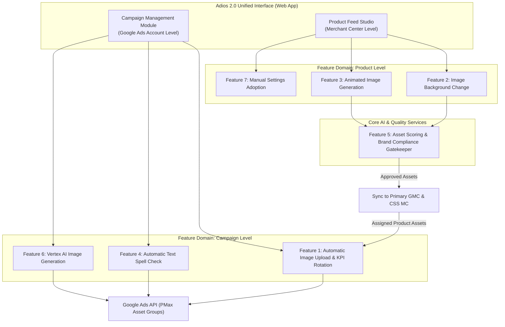

# Product Requirements Document (PRD): Adios 2.0 Advanced

> **Status:** Draft
> **Last Updated:** July 16, 2026
> **Target Audience:** Product, Engineering, and Performance Marketing Teams

---

## 1. Executive Summary & Vision

**Adios 2.0 Advanced** is an enterprise-grade automation and creative enhancement platform designed to manage, generate, and optimize **Performance Max (PMax)** campaign assets and **Google Merchant Center (GMC)** product media at scale.

By unifying automated asset ingestion from Google Cloud Storage (GCS), AI-powered visual transformations (background replacement and product animation), and rigorous quality guardrails (brand compliance scoring and spell checking), Adios 2.0 empowers marketing and e-commerce teams to drastically reduce manual overhead while achieving **"Excellent" PMax Ad Strength** and seasonal creative relevance.

---

## 2. Motivation & Problem Statement

Current management of PMax campaigns and product feeds across multi-brand e-commerce and retail organizations is labor-intensive and error-prone:
- **Manual Asset Replacement:** Marketing managers spend countless hours analyzing creative performance, identifying underperforming assets across individual asset groups, and manually re-uploading and re-assigning replacements via Google Ads Editor.
- **Seasonal Visual Inertia:** Adapting thousands of product images for seasonal events (e.g., Christmas, Summer Sales, Black Friday) requires extensive design and photography resources. Without automation, product feeds remain static and visually generic.
- **Missing Video Coverage:** PMax campaigns without custom videos trigger Google's auto-generated video templates, which frequently look unprofessional and degrade conversion rates.
- **Quality & Brand Risks:** Manual proofreading of dozens of headlines and descriptions leads to undetected spelling and grammar errors, while AI-generated imagery risks violating strict brand visual identities and legal guidelines.

---

## 3. Goals & Non-Goals

### 3.1 Goals
- **Automate Campaign Asset Management:** Streamline multi-asset group assignments, KPI-driven rotations, and scheduled promotional image placements from GCS/UI directly to Google Ads.
- **Enhance Product Creative Capability at Scale:** Enable automated background modifications and 6–15 second animated product videos generated from static Merchant Center imagery via automated video generation tools (e.g., Scene Machine / Vertex AI).
- **Enforce Automated Quality Guardrails:** Implement automated grammar and spell checks on text assets and AI-driven brand compliance scoring on generated visuals prior to human review.
- **Support Multi-Entity & Dual Merchant Center Architecture:** Ensure seamless synchronization across both primary Google Merchant Center (`GMC`) accounts and Comparison Shopping Service Partner (`CSS MC`) accounts.
- **Future-Proof Creative Studio:** Build modular integration pathways for text-to-image generation via Vertex AI (`Imagen` / `GenAI`).

### 3.2 Non-Goals
- **Fully Autonomous "Zero-Human" Publishing:** Human-in-the-loop (HITL) review and approval workflows remain a mandatory checkpoint for AI-generated visual content and spell-check corrections.
- **Full Replacement of Google Ads / Merchant Center UIs:** Adios 2.0 focuses strictly on creative asset management, AI enrichment, and feed optimization, delegating bid strategies, budget allocation, and core campaign settings to the native Google interfaces.
- **Automated Image Resizing & Cropping:** To prevent unintended visual distortion or cutoff, Adios 2.0 enforces a **no-resizing policy**. Images are processed and assigned strictly in their native uploaded aspect ratios.

---

## 4. Target Users & Operational Scope

### 4.1 Target User Personas
- **SEA & Marketing Managers:** Responsible for daily PMax campaign optimization, asset group assignments, KPI tracking, and promotional scheduling.
- **Brand Managers:** Responsible for maintaining visual and textual brand sovereignty across operating entities, setting scoring criteria, and auditing AI generation quality.
- **Creative Leads & Power Users:** Responsible for configuring category-specific AI generation prompts, defining scene templates, and managing asset pipelines.

### 4.2 Architectural Split: Campaign Level vs. Product Level
To ensure a clean system architecture and intuitive UX, functional capabilities are decoupled across two distinct operational boundaries:

> [!IMPORTANT]
> **Why this split matters:**
> **Campaign-level features (1, 4, 6)** operate via the **Google Ads API** directly on Asset Groups across campaigns.
> **Product-level features (2, 3, 7)** operate via the **Content API for Shopping** on individual Product IDs within Google Merchant Center.
> The user interface should reflect this natural boundary with dedicated tabs or modules, while allowing cross-pollination (e.g., pushing a newly animated product video from the Merchant Center Studio directly into a PMax Asset Group).
> **API Boundary & Tech Stack:** The backend tier is engineered in **Python 3.11+ / FastAPI / Pydantic v2 / Uvicorn**. The **Angular 22+ (TypeScript)** frontend single-page web app (built with Standalone Components and Signals) communicates strictly across decoupled REST JSON endpoints (`/v1/campaigns/...`, `/v1/products/...`, `/v1/ai/...`). No Python runtime structures or internal stack traces leak across the REST boundary.

---

## 5. Glossary of Terms

| Term | Definition |
| :--- | :--- |
| **PMax** | Performance Max campaigns in Google Ads, utilizing AI to serve ads across all Google inventory. |
| **GCS** | Google Cloud Storage, used as the underlying object storage for raw and processed media assets. |
| **MC / GMC** | Google Merchant Center, where product data feeds and SKU attributes (e.g., `image_link`, `video_link`) are hosted. |
| **CSS MC** | Comparison Shopping Service Merchant Center, a separate partner MC instance used in regional retail setups. |
| **Asset Group** | A collection of creatives (images, videos, headlines, descriptions, logos) within a PMax campaign centered around a theme. |
| **KPI** | Key Performance Indicator (e.g., CTR, Impressions, Conversions, ROAS) used to evaluate and rotate assets. |
| **Own-Brand (First-Party) SKUs** | Products owned fully by the operating organization, possessing unencumbered image and intellectual property rights. |
| **HITL** | Human-In-The-Loop, requiring human verification before publishing generated content. |

---

## 6. Global Technical Requirements

1. **Configurable GCP Model & Compute Residency:**
   All AI model inference (Vertex AI, Scene Machine) and data processing locations **MUST be strictly configurable**. For enterprise organizations operating in restricted regulatory jurisdictions, execution and cloud hosting must be lockable to specific cloud regions (e.g., EU data residency zones such as `europe-west1` / `europe-west3`) to comply with data sovereignty guidelines.
2. **Scalability & Concurrency (Python 3 / FastAPI Backend):**
   The Python 3 / FastAPI backend scheduler (`asyncio` / background task workers) and bulk processing engines must reliably handle large-scale batch jobs (e.g., processing 10,000+ SKU background changes or multi-campaign asset rotations) without API rate-limit exhaustion or timeout failures.
3. **No Image Resizing / Native Aspect Ratio Enforcement:**
   The system must automatically detect image dimensions upon upload or generation and assign them exclusively to their valid PMax slot:
   - **Landscape (1.91:1):** Assigned to `MARKETING_IMAGE` (Max: 20 per asset group).
   - **Square (1:1):** Assigned to `SQUARE_MARKETING_IMAGE` (Max: 20 per asset group).
   - **Portrait (4:5):** Assigned to `PORTRAIT_MARKETING_IMAGE` (Max: 20 per asset group).
4. **Service Account & API Governance:**
   Dedicated OAuth/Service Account credentials must be established for Google Ads API, Content API for Shopping, and YouTube Data API with granular scoping.
5. **Strict Pydantic v2 Schema Validation & Resource-Oriented API Boundaries:**
   All API endpoints exposed by the FastAPI backend must validate request and response payloads via strict **Pydantic v2 (`BaseModel`) schemas**. Errors must be returned as structured JSON containing canonical HTTP status codes, error domains, and actionable messages, ensuring a clean decoupling between the backend service and the client Angular 22+ Web App.

---

## 7. Feature Specifications & User Stories

### Feature 1: Automatic Image Upload & KPI Rotation
- **Priority:** P1 | **Effort:** Medium | **Operational Level:** Campaign (Google Ads)

#### User Story
> *As a marketing manager, I want to upload images via the Adios 2.0 UI and assign them in bulk across multiple PMax asset groups with automated KPI-driven replacement and scheduling, so that I can eliminate manual upload overhead and ensure top-performing creative rotation.*

#### Process & Functional Requirements
1. **Bulk Upload & Asset Group Selection:**
   - Users upload static images via the Adios 2.0 UI.
   - The interface displays an interactive, filterable list of all available PMax Asset Groups (filterable by Account ID, Campaign Name, Asset Group Name, or ID).
   - Users check target Asset Groups and click **"Save"** to initiate bulk assignment across all selected groups.
2. **KPI-Driven Smart Replacement:**
   - If an Asset Group has reached its slot capacity (e.g., 20/20 Square Images; configurable threshold via admin variables), the system queries the Google Ads API for asset performance metrics over a user-selected evaluation window (e.g., last 30 days).
   - The user selects the governing **KPI metric** in the UI (`Impressions`, `CTR`, `Conversions`, `ROAS`, or `Ad Strength contribution`).
   - The system automatically unlinks/replaces the **lowest-performing asset** of the matching aspect ratio and attaches the newly uploaded asset.
3. **Protected / Fixed Assets ("Must Not Replace"):**
   - Users can lock specific high-value or brand-mandatory images within an Asset Group (via UI toggle or file naming convention such as `*_FIXED.*`).
   - Protected assets are excluded from the candidate pool during KPI-driven eviction.
4. **Scheduled Promotional Images & Fallback Logic:**
   - Users can assign a **start date/time** and **end date/time** to uploaded promotional assets (e.g., "Seasonal 20-% Off Sale").
   - A daily background scheduled task checks active timers:
     - **Activation:** At start time, the promotional image is inserted into the target Asset Group (evicting the lowest-performing non-protected asset if necessary).
     - **Expiration & Reversion:** At end time, the promotional asset is removed. The system automatically restores the exact image that was evicted prior to the schedule, OR if unavailable, assigns an asset from a pre-configured **"Fallback Bucket"** (GCS folder of evergreen brand imagery).
5. **Audit & Execution Reporting:**
   - The UI provides a dedicated **Replacement Summary & Error Log Table** containing: `Timestamp | Account | Campaign Name | Asset Group Name | Replaced Asset ID/Name | New Asset ID/Name | Reason (KPI Optimization vs. Scheduled Promo) | Status (Success/Error details)`.
6. **Dimension-Locked vs. Cross-Dimension Replacement:**
   - Users can configure whether replacements occur strictly within the same aspect ratio bucket (e.g., a 1:1 image only replaces the worst 1:1 image) to maintain exact dimensional balance (e.g., maintaining a strict 5 Landscape, 5 Square, 5 Portrait ratio).

---

### Feature 2: Image Background Change
- **Priority:** P2 | **Effort:** Large | **Operational Level:** Product ID (Merchant Center)

#### User Story
> *As a marketing manager, I want to modify product image backgrounds in bulk using category presets and AI generation, so that I can dynamically adapt e-commerce visuals for seasonal themes (Christmas, Summer, Sales) without manual photo shoots.*

#### Process & Functional Requirements
1. **Product Selection:**
   - Users select products directly from their Merchant Center feed inside the Adios 2.0 UI via:
     - **Category Filtering:** Select entire product categories (e.g., `Pet Supplies > Dry Food`, `Home & Garden > Outdoor Lighting`).
     - **Bulk ID Ingestion:** Paste or upload a list/CSV of Product IDs (`item_id`).
     - **Manual Multi-Select:** Interactive grid selection.
2. **Styling & Scene Configuration:**
   - Integrated with **Feature 7 (Manual Settings Adoption)** and **Feature 5 (Brand Guardrails)**, users configure visual prompt parameters:
     - **Theme / Seasonality:** Spring, Summer, Autumn, Winter, Holiday Season, Promotional Sale.
     - **Background Focus:** Blurry (bokeh) vs. Sharp architectural/natural details.
     - **Scene Context:** Modern living room, kitchen counter, sunny outdoor patio, forest, minimalist studio backdrop.
     - **Color & Lighting:** Warm studio lighting, bright natural sunlight, brand color accent harmony.
     - **Style:** Elegant, Playful, Dynamic, Minimalist.
     - **Negative Prompting / Exclusions:** Strict rules defining what MUST NOT appear (e.g., "no text, no people, no competing brand logos, no watermarks, no distorted objects").
     - **Target Aspect Ratios:** Generate variations for 1:1, 4:5, 1.91:1, and 9:16.
3. **Human-in-the-Loop (HITL) Review Studio:**
   - Generated backgrounds are presented in a review grid where Marketing and Creative teams can:
     - **Confirm (Approve):** Queues asset for downstream MC upload.
     - **Reject with Comment:** User inputs specific feedback (e.g., "Shadow looks unnatural, background too distracting"). This comment feeds directly into the AI prompt for an immediate single-item **Regenerate** attempt.
     - **Batch Export:** Download a summary report of rejected `item_id`s and rejection reasons for audit purposes.
4. **Merchant Center Synchronization & Dual-ID Handling:**
   - Approved images are hosted on a publicly accessible GCS bucket within the configured cloud residency region.
   - The backend uses the **Content API for Shopping** to update the product feed, replacing `image_link` or appending to `additional_image_links`.
   - **Dual-ID Sync:** For organizations maintaining both a Primary GMC and a CSS Partner MC, the system must simultaneously update both account feeds to ensure consistent shopping ad display across all channels.
5. **Reversion & PMax Integration:**
   - Users can revert a product's `image_link` back to the original studio photo with a single click if performance drops.
   - Approved background-enhanced product images can be pushed directly to **Feature 1** to be used as lifestyle assets across PMax campaigns.

> [!WARNING]
> **Legal Guardrail (First-Party Product Restriction):**
> To mitigate copyright infringement and third-party licensing violations, automated background replacement and animation MUST be technically restricted in Phase 1 exclusively to **Own-Brand (First-Party) products** where the organization owns 100% of the image rights.

---

### Feature 3: Animated Image Generation
- **Priority:** P2–P3 | **Effort:** Large | **Operational Level:** Product ID (MC & YouTube)

#### User Story
> *As a marketing manager, I want to automatically generate 6–15 second animated product videos from static Merchant Center images using automated video generation tools (e.g., Scene Machine), ensuring complete high-converting video coverage across all PMax orientation requirements.*

#### Process & Functional Requirements
1. **Category-Driven Animation Presets:**
   - Users select top-selling or seasonal SKU batches via the Product Studio interface.
   - Based on product category, the system applies tailored motion templates:
     - **Food / Packaged Goods (Example):** Static product package displayed prominently in the foreground; a serving bowl sits next to it while food smoothly falls from above into the bowl over 8 seconds.
     - **Fluids / Household Goods (Example):** A transparent container slowly filling with shimmering water or dynamic ambient motion over 6 seconds.
2. **Video Specifications & Aspect Ratios:**
   - Outputs must be generated in **Horizontal (16:9)**, **Vertical (9:16)**, and **Square (1:1)** formats, lasting between 6 to 15 seconds (meeting PMax minimum length requirements while maintaining engaging pacing).
3. **HITL Review & Prompt Tuning:**
   - Review flow identical to Feature 2 (Confirm, Reject + Comment, Regenerate).
   - Animation prompts are parameterized by entity brand profiles and category templates.
4. **YouTube Hosting & Feed Assignment:**
   - Because Google Ads and Merchant Center require videos to be hosted on YouTube, the system integrates with the **YouTube Data API v3**:
     - If the user configures an **Advertiser-Owned Brand YouTube Channel ID**, the video is uploaded and set to `PUBLIC` or `UNLISTED`.
     - If omitted, the system utilizes Google's auto-generated channel, forcing an `UNLISTED` privacy setting.
   - The resulting YouTube URL is injected into the Merchant Center `[video_link]` attribute across both Primary GMC and CSS MC accounts, and made available for direct attachment to PMax asset groups.
5. **Rapid POC Integration (Scene Machine Shortcut):**
   - As a lightweight fallback/POC pathway, the UI provides a **"Create in Scene Machine"** action which bundles selected Adios 2.0 GCS static assets into a pre-configured, import-ready project link for manual creative fine-tuning.

---

### Feature 4: Automatic Spell Check
- **Priority:** P4 | **Effort:** Small | **Operational Level:** Campaign Text Assets

#### User Story
> *As a marketing manager, I want an automated spell and grammar checking engine to scan all text assets in my PMax campaigns, flagging typos and suggesting corrections so I can maintain professional ad quality.*

#### Process & Functional Requirements
1. **Execution Modes:**
   - **On-Demand Scan:** User clicks "Run Spell Check" for selected accounts or campaigns.
   - **Scheduled Audit:** Automated recurring scan (e.g., monthly or bi-weekly cron job).
2. **Scope of Inspection:**
   - Scans all text fields within active PMax Asset Groups: `headlines` (max 30 chars), `long_headlines` (max 90 chars), `descriptions` (max 90 chars), and `path` strings.
3. **Interactive Resolution Table:**
   - Results are presented in an actionable review table:
     - `Campaign | Asset Group | Asset Type | Current Text | Flagged Error / Typo | AI Suggested Correction | Action`
   - Actions per row: **[Accept Suggestion]** (overwrites text), **[Deny / Ignore]** (marks as false positive), or **[Inline Edit]** (user modifies correction manually while respecting character limit validation).
4. **Bulk Apply & External Integration:**
   - Once all rows are reviewed, clicking **"Apply & Sync"** updates the text assets directly in Google Ads via the API.
   - Optional export/import capability via CSV for external review or integration with brand localization and compliance verification tools.

---

### Feature 5: Asset Scoring & Brand Compliance Gatekeeper
- **Priority:** Subproject of Asset Generation | **Effort:** Medium | **Operational Level:** AI Pipeline Gatekeeper

#### User Story
> *As a brand manager, I want all AI-generated images and animations to pass through an automated technical and brand-compliance scoring filter before reaching human reviewers, ensuring only high-quality, compliant assets are evaluated.*

#### Process & Functional Requirements
1. **Automated Technical Gate (Pass/Fail):**
   - **Dimensions & Aspect Ratios:** Exact match verification for 1:1, 4:5, 1.91:1, 16:9, or 9:16.
   - **Resolution & File Size:** Minimum resolution thresholds (e.g., ≥1200x628 for landscape) and file sizes ≤5 MB for images.
   - **Video Metrics:** Duration strictly between 6s and 60s; framerate stability check.
2. **AI Vision & Brand Rules Gate (Scored 0–100):**
   - Evaluates the generated asset against machine-readable brand guidelines (ingested via structured rule files):
     - **Product Integrity:** Entire product/bundle must be fully visible without edge clipping (`Score -30` if clipped).
     - **Centering & Composition:** Primary SKU must occupy the focal center (`Score -15` if off-center).
     - **Hallucination & Artifact Check:** Detects and penalizes non-existent accessories, strange text, or distorted elements (`Score -50` / Auto-Fail).
     - **Promotional Cleanliness:** Verifies absence of unauthorized promotional overlays or sale badges (`Auto-Fail`).
     - **Lighting & Camera Motion:** Verifies appropriate lighting and smooth, non-jittery camera motion for animations.
3. **Automated Pipeline Routing:**
   - **Score ≥ 85:** Automatically routed to the HITL Review Studio for human approval.
   - **Score < 85 or Auto-Fail:** Automatically rejected by the system and queued for immediate **self-healing re-generation** (up to 2 retry attempts with adjusted temperature/negative prompts) before alerting a human.

---

### Feature 6: Vertex AI Image Generation (Future Scope)
- **Priority:** Future | **Effort:** Extra Large | **Operational Level:** Creative Studio

#### User Story
> *As a creative lead, I want to generate entirely new lifestyle images from scratch using Vertex AI text-to-image prompts when no product photography exists for a specific campaign theme.*

#### Key Capabilities
- Prompt-based generation utilizing latest-generation Vertex AI models (`Imagen 3` / `GenAI`).
- Native aspect ratio selection (1:1, 4:5, 1.91:1) at generation time.
- Parameterized character and visual style consistency across multi-image campaign variations.
- Direct output injection into Adios 2.0 GCS buckets and PMax asset assignment workflows.

---

### Feature 7: Manual Settings Adoption & Category Configurations
- **Priority:** Support / Power User | **Effort:** Small | **Operational Level:** UI Configuration

#### User Story
> *As a power user, I want a lightweight interface (via a Web App configuration module) to manually map product categories to specific AI generation settings and prompt templates.*

#### Key Capabilities
- Dropdown selections allowing users to map Merchant Center `google_product_category` (or custom labels) to specific Feature 2 & 3 presets (e.g., mapping `Category: Pet Food` -> `Scene: Modern Kitchen` + `Animation: Falling Kibble`).
- Configuration persistence across multi-user team workspaces.

---

## 8. End-to-End Use Cases & Workflows

### Use Case A: Seasonal Holiday Transition across 5,000 SKUs
1. **Setup:** In October, an SEA manager selects 5,000 own-brand products across the primary GMC account via the Product Studio.
2. **Config:** Selects `Theme: Holiday Season`, `Background: Cozy living room with blurred festive lights`, and checks `Generate 1:1, 4:5, 1.91:1`.
3. **Automated Gatekeeping:** Feature 5 runs generation; 4,600 pass scoring (>85) and enter the HITL review grid; 400 auto-fail (due to clipped product boundaries) and are automatically regenerated.
4. **HITL Review:** Marketing team approves 4,950 images in bulk and rejects 50 with comments.
5. **Sync:** Approved URLs are pushed simultaneously to the primary GMC and CSS Partner MC feeds as `additional_image_links`, and sent to Feature 1 with a scheduled timer: *Active Nov 1 – Dec 26*.
6. **Reversion:** On Dec 27, the scheduler automatically removes the holiday assets from all PMax asset groups and restores the baseline studio images.

### Use Case B: Pre-Flight Campaign Quality Audit
1. A marketing manager uploads 40 new banner images and 15 headlines for a major summer promotion via Feature 1.
2. The user runs Feature 4 (Spell Check). The system flags `"Summr Discounts on All Items"` in Headline 3 and suggests `"Summer Discounts on All Items"`. The user clicks **Accept** to patch the headline.
3. The user selects 12 target PMax asset groups and clicks **Save**. The system checks capacity; where slots are full, it identifies the lowest-CTR evergreen images, evicts them, and assigns the new summer banners while respecting all protected (`*_FIXED`) brand logos.

---

## 9. HEART Metrics & Success Evaluation

| Metric Category | Goals | Signals | Key Performance Indicators (KPIs) |
| :--- | :--- | :--- | :--- |
| **Happiness** | High user satisfaction with automated workflows and creative quality | Positive feedback from SEA/Brand managers during review cycles | • Semi-annual User Satisfaction Score (CSAT / NPS > 40) • Qualitative review studio feedback ratings |
| **Engagement** | Daily/weekly reliance on the tool for ongoing PMax and MC management | Regular asset uploads, background transformations, and spell check runs | • Daily / Weekly Active Users (DAU / WAU) • Total volume of assets processed and published per week |
| **Adoption** | Rapid transition from manual Google Ads Editor workflows to Adios 2.0 | Teams migrating campaign creation and seasonal updates to the interface | • % of total PMax campaigns managed via Adios 2.0 • Number of GMC accounts / brand entities onboarded |
| **Retention** | Sustained long-term usage across repeated promotional and seasonal cycles | Repeat usage of scheduling and AI background modules quarter-over-quarter | • Quarter-over-quarter tool retention rate (>85%) • Repeat usage rate during major seasonal events (Spring, Summer, Black Friday, Holiday Season) |
| **Task Success** | Drastic reduction in manual overhead and elimination of publishing errors | Fast completion of asset group assignments, high HITL approval rates | • Manual hours saved per asset group update (Target: >75% reduction) • AI Asset First-Pass Approval Rate (Target: >80% pass without regeneration) • Zero spell-check / brand compliance violations in live campaigns |

---

## 10. Performance Max (PMax) Best Practices & Guardrails

To maximize campaign performance and align with Google's core algorithm requirements, Adios 2.0 enforces the following guidelines across all automated workflows:

### 🟢 The Do's of PMax Optimization
- **Pursue "Excellent" Ad Strength:** High ad strength directly unlocks broader placement coverage, lower CPCs, and superior conversion efficiency. Adios 2.0 workflows are engineered to continuously push asset groups toward this rating.
- **Max out Asset Variations & Orientations:** Provide at least 15 images per asset group with balanced coverage across **Landscape (1.91:1)**, **Square (1:1)**, and **Portrait (4:5)**.
- **Complete Text Asset Matrix:** Always populate the full text matrix: up to 15 headlines (mixing <15 and <30 character variations) and 5 descriptions (mixing <60 and <90 character variations).
- **Provide Multi-Orientation Custom Videos:** Supply at least 3–5 high-quality videos (10–60s duration) covering **Horizontal (16:9)**, **Vertical (9:16)**, and **Square (1:1)** formats to capture YouTube Shorts, in-stream, and feed inventory.
- **Strict Thematic Segmentation:** Create distinct asset groups organized tightly by product category, profit margin, or seasonal event to prevent mismatched messaging.

### 🔴 The Don'ts of PMax Optimization
- **NEVER Allow Auto-Generated Videos:** If an asset group lacks custom video assets, Google automatically synthesizes a video slideshow from static images. These auto-generated videos look unprofessional and harm ad performance. *Guardrail:* Adios 2.0 Feature 3 specifically bridges this gap by ensuring every key product has custom, high-quality animated videos.
- **NEVER Mix Mismatched Dimensions:** Forcing a cropped landscape image into a square or vertical slot degrades CTR. Adios 2.0 strictly enforces native aspect ratio assignments without artificial cropping.

---

## 11. Caveats, Risks & Open Questions

| Area | Risk / Open Question | Mitigation / Action Item |
| :--- | :--- | :--- |
| **Brand Guidelines** | AI models require machine-readable brand guidelines (structured text/rules) per brand entity, which currently vary in format. | **Action:** Standardize a unified JSON/YAML brand configuration schema across all operating entities before Feature 5 rollout. |
| **GCS Folder Architecture** | Should one PMax campaign act as a blueprint for the GCS folder directory (`/campaign_name/asset_group/aspect_ratio/`)? | **Action:** Establish a standardized, hierarchical GCS bucket structure that automatically mirrors the live Google Ads campaign topology for automated synchronization. |
| **Legal & Image Rights** | Risk of generating backgrounds or animations for third-party brand products where the organization lacks derivative modification rights. | **Guardrail:** Hardcode a metadata filter that restricts Features 2 & 3 exclusively to first-party (`Own-Brand`) SKU lists during initial deployment. |
| **YouTube Channel Governance** | Uploading thousands of SKU animations via API could clutter official public brand YouTube channels. | **Mitigation:** Utilize specific Advertiser-Owned Brand channels with forced `UNLISTED` status for product-level animations, keeping public channels reserved for major brand spots. |
| **LLM Comment Loop** | Can reviewer rejection comments (e.g., "too blurry") reliably guide AI models to fix the issue on regeneration? | **Action:** Develop a prompt-enrichment middleware that translates natural language reviewer feedback into structured negative/positive prompt modifiers for retry attempts. |
